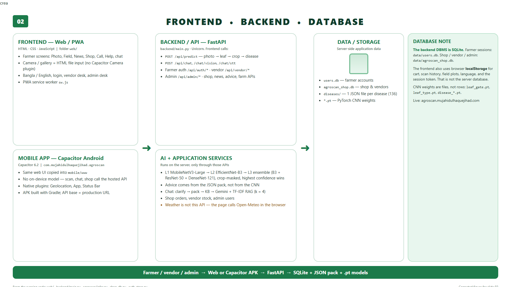
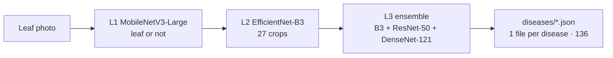
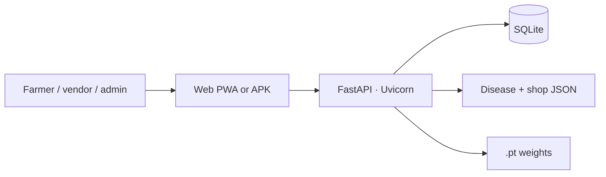

<div align="center">


# AgroScan

**Early detection, better harvest**

পাতার ছবি তুলুন — ফসল ও রোগ জানুন — বাংলায় পরামর্শ পান

[](https://agroscan.mujahidulhaquejihad.com)
[](https://www.python.org/)
[](https://fastapi.tiangolo.com/)
[](https://pytorch.org/)
[](https://agroscan.mujahidulhaquejihad.com)
[](mobile/README.md)

A Bangladesh-first helper for farmers: **leaf photo → crop → disease → local advice**, plus shop, vendor, and admin desks. Not a replacement for DAE or **কৃষি কল সেন্টার 16123**.

</div>

---

<p align="center">
  
</p>

<p align="center"><sub>Web / PWA and Capacitor APK share one UI. Models and SQLite live on the server. Weather is Open-Meteo in the browser.</sub></p>

## How a scan works



Highest-confidence disease model wins (no averaging). Crop-masked classes only. Advice is **not** generated by the CNN.



Chat is pack-first: **clarify → pack → knowledge base → Gemini**, with TF-IDF RAG (`k = 4`). The phone never runs ONNX.

## What you get

| | Farmer | Vendor | Admin |
|---|---|---|---|
| **Photo** | 3-level vision + Bangla/English steps | — | — |
| **Field** | plots, history, weather (Open-Meteo) | — | — |
| **Chat** | pack + RAG + Gemini | — | — |
| **Shop** | cart in localStorage, orders via API | listings, stock, orders | catalogue, users, ads |
| **Call** | 16123 / 16358 and DAE links | — | — |
| **Auth** | farmer session | vendor token | admin token |

Also: PWA (`web/sw.js`), Google sign-in (optional), news, farm planning from the Bangladesh data pack.

## Quick start

You need Python 3.11+, the weights under `models/` (`leaf_gate.pt`, `leaf_type.pt`, `disease_*.pt` — they are gitignored), and a copy of `.env.example`.

```bash
git clone https://github.com/mujahidulhaquejihad/Agroscan.git
cd Agroscan

python -m venv .venv
# Windows:  .venv\Scripts\activate
# Linux:    source .venv/bin/activate

pip install -r requirements.txt
# Install a matching torch/torchvision build from https://pytorch.org

copy .env.example .env          # Windows
# cp .env.example .env          # Linux
# Fill GEMINI_API_KEY if you want chat. Change admin/vendor tokens before a public host.

python -m uvicorn backend.main:app --host 0.0.0.0 --port 8000
```

Open [http://localhost:8000](http://localhost:8000). Do not double-click `index.html` — the UI must be served by FastAPI.

Check models:

```bash
curl http://127.0.0.1:8000/api/status
```

Production host: [https://agroscan.mujahidulhaquejihad.com](https://agroscan.mujahidulhaquejihad.com) · deploy notes in [`docs/DEPLOY_MOBILE.md`](docs/DEPLOY_MOBILE.md).

### Android APK

Same web UI in `mobile/www`. Package `com.mujahidulhaquejihad.agroscan`. Camera is an HTML file input (no Capacitor Camera plugin). See [`mobile/README.md`](mobile/README.md).

## Repo map

```text
web/                 farmer PWA, vendor.html, admin.html
backend/main.py      FastAPI — predict, chat, auth, shop, news, farm
agroscan/            infer, RAG, shop_db, auth_store, Bangladesh pack loaders
data/agroscan/       disease cards, products, upazilas, …
models/              .pt checkpoints (not in git)
mobile/              Capacitor 6.2 Android shell
docs/                stack figure, deploy, viva notes
```

| Want | File |
|------|------|
| How the web app works | [`docs/HOW_THE_WEBAPP_WORKS.txt`](docs/HOW_THE_WEBAPP_WORKS.txt) |
| Train / resume vision | [`docs/TRAINING_CHECKPOINTS.md`](docs/TRAINING_CHECKPOINTS.md) |
| Dataset citations | [`docs/AgroScan_Dataset_References.pdf`](docs/AgroScan_Dataset_References.pdf) |
| Pack caveats | [`data/agroscan/README.md`](data/agroscan/README.md) |

## API surface

| Method | Path | Role |
|--------|------|------|
| `GET` | `/api/status` | which nets loaded |
| `POST` | `/api/predict` | photo → leaf → crop → disease |
| `POST` | `/api/chat`, `/api/chat/vision`, `/api/chat/stt` | chat ladder |
| `*` | `/api/auth/*` | farmer |
| `*` | `/api/vendor/*` | vendor desk |
| `*` | `/api/admin/*` | admin desk |
| `*` | `/api/shop/*` | catalogue + orders |
| `GET` | `/api/news`, `/api/advice`, `/api/farm/*` | content + planning |

SQLite: `data/users.db` (accounts) and `data/agroscan_shop.db` (shop). Cart, language, plots, and the session token stay in **browser localStorage**.

## Training data (short)

Vision was built from PlantVillage / Hughes & Mohanty, the Kaggle-augmented PlantVillage set, PlantDoc, a Bangladesh leaf zip, Saon (Hugging Face), plus ImageNet for the leaf gate. Full citations: [`docs/AgroScan_Dataset_References.pdf`](docs/AgroScan_Dataset_References.pdf). `Datasets/` is local-only and not pushed.

## Disclaimer

AgroScan is a decision-support tool for coursework and field trials. Doses, brands, and AP numbers in the pack must be checked against the current DAE Plant Protection Wing list and the product label. Call **16123** (agriculture) or **16358** (livestock) for serious cases.

## Team

CSE400 · BRAC University · Supervisor **Md. Shahriar Rahman**

Mujahidul Haque Jihad · Shourav Saha · Sayed Arifin Ahmed Alak · Mehreen Momtaz

---

<div align="center">

**পাতা দেখুন। ফসল বাঁচান।**

</div>
